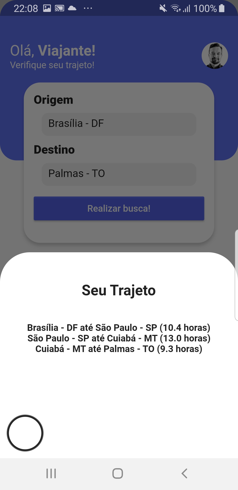

# BusTravel

**Número da Lista**: 1 
**Conteúdo da Disciplina**: Grafos1 

## Alunos
|Matrícula | Aluno |
| -- | -- |
| 19/0044403  |  Victor Souza Dantas Martins Lima |
| 19/0020903  |  Vitor Magalhães Lamego |

## Sobre 
O projeto tem como objetivo analisar as possíveis rotas entre duas cidades da companhia de ônibus e trazer por meio dele o percurso mais rápido e mais barato, isso é feito por meio do algoritmo de Bellman-Ford que recebe o grafo e seus nós e por meio disso realiza a análise de cada caminho existente entre os ponto de partida e o ponto final.

## Screenshots

## Instalação 
**Linguagem**: Dart 
**Framework**: Flutter 
É necessário que o framework flutter esteja devidamente instalado, pode ser verificado se tudo está correcto com o comando flutter doctor --v. Além disso é necessário um emulador ou telefone para rodar a aplicação por meio do comando "flutter run".

## Uso 
Digite "flutter run" para rodar em um emulador ou no próprio telefone e utilize a interface para obter as rotas desejadas.

## Vídeo

segue o link para vídeo de apresentação: https://youtu.be/hF7sw3kLN0s

